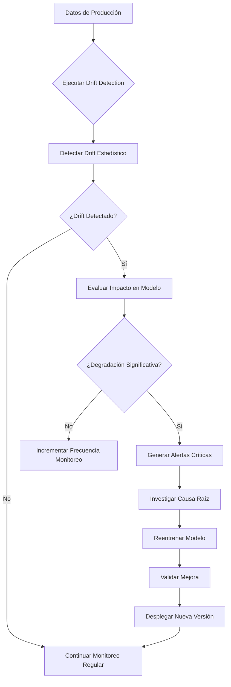

# 📊 Sistema de Detección de Data Drift

**Versión:** 1.0.0  
**Fecha:** Noviembre 2025  
**Equipo:** MLOps-GPO45  
**Responsable:** Alex (Data Scientist - Data Manipulation & Feature Engineering)

---

## 📋 Tabla de Contenidos

1. [Descripción General](#descripción-general)
2. [Arquitectura del Sistema](#arquitectura-del-sistema)
3. [Componentes](#componentes)
4. [Instalación y Configuración](#instalación-y-configuración)
5. [Guía de Uso](#guía-de-uso)
6. [Tipos de Drift Implementados](#tipos-de-drift-implementados)
7. [Métodos de Detección](#métodos-de-detección)
8. [Sistema de Alertas](#sistema-de-alertas)
9. [Ejemplos](#ejemplos)
10. [Mejores Prácticas](#mejores-prácticas)
11. [Troubleshooting](#troubleshooting)

---

## 🎯 Descripción General

El **Sistema de Detección de Data Drift** es una solución completa para monitorear, detectar y evaluar cambios en las distribuciones de datos que pueden afectar el rendimiento de modelos de machine learning en producción.

### Características Principales

✅ **Simulación de Drift**: Genera escenarios controlados de drift  
✅ **Detección Estadística**: Múltiples métodos (KS-Test, PSI, JS-Divergence)  
✅ **Evaluación de Impacto**: Mide degradación en performance del modelo  
✅ **Sistema de Alertas**: Umbrales configurables y notificaciones  
✅ **Integración MLflow**: Carga automática de modelos y métricas  
✅ **Exportación de Resultados**: JSON, CSV para análisis posterior  

### ¿Por qué es importante?

**Data drift** ocurre cuando las distribuciones de los datos de entrada cambian con el tiempo, causando:

- 📉 Degradación del rendimiento del modelo
- ❌ Predicciones inexactas
- 💰 Pérdidas de negocio
- 🔄 Necesidad de reentrenamiento

**Detectar drift a tiempo** permite tomar acciones proactivas antes de que afecte producción.

---

## 🏗️ Arquitectura del Sistema

```
┌─────────────────────────────────────────────────────────────┐
│                    SISTEMA DE DRIFT DETECTION                │
└─────────────────────────────────────────────────────────────┘
                              │
                              ↓
    ┌─────────────────────────────────────────────────────┐
    │         1. SIMULACIÓN DE DRIFT (DriftSimulator)      │
    │   • Mean Shift    • Variance Change                 │
    │   • Missing Values • Seasonal Drift                  │
    │   • Category Drift • Combined Scenarios             │
    └────────────────────┬────────────────────────────────┘
                         │
                         ↓
    ┌─────────────────────────────────────────────────────┐
    │      2. DETECCIÓN ESTADÍSTICA (DriftDetector)        │
    │   • Kolmogorov-Smirnov Test                         │
    │   • Population Stability Index (PSI)                │
    │   • Jensen-Shannon Divergence                       │
    │   • Chi-Squared Test                                │
    └────────────────────┬────────────────────────────────┘
                         │
                         ↓
    ┌─────────────────────────────────────────────────────┐
    │     3. EVALUACIÓN DE IMPACTO (DriftEvaluator)       │
    │   • Carga modelo desde MLflow                       │
    │   • Evalúa métricas (MAE, RMSE, R2)                │
    │   • Calcula degradación                             │
    │   • Genera recomendaciones                          │
    └────────────────────┬────────────────────────────────┘
                         │
                         ↓
    ┌─────────────────────────────────────────────────────┐
    │     4. SISTEMA DE ALERTAS (DriftAlertSystem)        │
    │   • Umbrales configurables                          │
    │   • Severidad: WARNING / CRITICAL                   │
    │   • Historial de alertas                            │
    │   • Acciones recomendadas                           │
    └─────────────────────────────────────────────────────┘
```

---

## 🧩 Componentes

### 1. `DriftSimulator`

**Propósito**: Simular diferentes tipos de drift para evaluación y testing.

**Métodos principales**:
- `simulate_mean_shift()`: Desplaza la media de features numéricas
- `simulate_variance_change()`: Modifica la varianza manteniendo la media
- `simulate_missing_values()`: Introduce valores faltantes
- `simulate_seasonal_drift()`: Aplica patrones estacionales/cíclicos
- `simulate_category_drift()`: Cambia distribuciones categóricas
- `simulate_combined_drift()`: Combina múltiples tipos de drift

**Ejemplo**:
```python
from monitoring.drift_simulator import DriftSimulator

simulator = DriftSimulator(df_baseline, random_state=42)

# Drift moderado en múltiples features
df_drift = simulator.simulate_combined_drift(
    mean_shift_cols=['n_tokens_content', 'num_hrefs'],
    variance_cols=['kw_avg_avg'],
    missing_cols=['num_videos'],
    intensity='moderate'
)
```

---

### 2. `DriftDetector`

**Propósito**: Detectar cambios estadísticos en distribuciones de datos.

**Métodos de detección**:

| Método | Tipo de Feature | Rango | Interpretación |
|--------|----------------|-------|----------------|
| **KS-Test** | Numérica continua | 0-1 | >0.2 = drift significativo |
| **PSI** | Cualquiera | 0-∞ | >0.25 = drift alto |
| **JS-Divergence** | Cualquiera | 0-1 | >0.3 = drift alto |
| **Chi-Squared** | Categórica | 0-∞ | p<0.05 = drift significativo |

**Ejemplo**:
```python
from monitoring.drift_detector import DriftDetector

detector = DriftDetector(df_baseline, df_monitoring)

# Detectar drift en columnas clave
results = detector.detect_all_drift(
    columns=['n_tokens_content', 'num_hrefs', 'kw_avg_avg'],
    methods=['ks', 'psi', 'js']
)

# Ver features con drift alto
high_drift = results[results['psi_severity'] == 'high']
print(high_drift)
```

---

### 3. `DriftEvaluator`

**Propósito**: Evaluar el impacto del drift en el rendimiento del modelo.

**Funcionalidades**:
- ✅ Carga modelo desde MLflow Registry
- ✅ Evalúa métricas (MAE, RMSE, R2) en datos con drift
- ✅ Compara con métricas baseline
- ✅ Calcula score de degradación (0-100)
- ✅ Genera recomendaciones de acción

**Ejemplo**:
```python
from monitoring.drift_evaluator import DriftEvaluator

evaluator = DriftEvaluator(
    model_name="HistGradientBoosting (Poisson)",
    mlflow_tracking_uri="http://127.0.0.1:5000"
)

# Evaluar impacto
impact = evaluator.evaluate_drift_impact(X_drift, y_drift)

# Ver resumen
print(evaluator.generate_impact_summary(impact))
```

**Score de Degradación**:
- **<5**: Sin degradación
- **5-15**: Degradación leve
- **15-30**: Degradación moderada
- **>30**: Degradación severa

---

### 4. `DriftAlertSystem`

**Propósito**: Sistema de alertas configurable para monitoreo continuo.

**Características**:
- 🎯 Umbrales configurables por métrica
- 🚨 Niveles de severidad: INFO, WARNING, CRITICAL
- 📊 Historial de alertas persistente
- 📤 Export/import en JSON

**Umbrales por defecto**:

| Métrica | WARNING | CRITICAL |
|---------|---------|----------|
| PSI | 0.10 | 0.25 |
| KS Statistic | 0.15 | 0.30 |
| JS Divergence | 0.15 | 0.30 |
| Degradation Score | 15.0 | 30.0 |
| R2 Change | -10% | -20% |
| MAE Change | +15% | +30% |

**Ejemplo**:
```python
from monitoring.drift_alert_system import DriftAlertSystem

alert_system = DriftAlertSystem()

# Verificar alertas de drift
drift_alerts = alert_system.check_drift_alerts(drift_results)

# Verificar alertas de performance
perf_alerts = alert_system.check_model_performance_alerts(impact_report)

# Ver resumen
print(alert_system.generate_alert_summary(drift_alerts + perf_alerts))

# Exportar historial
alert_system.export_alert_history('outputs/alerts.json')
```

---

## 🚀 Instalación y Configuración

### Requisitos

```bash
Python >= 3.8
pandas >= 1.3.0
numpy >= 1.21.0
scipy >= 1.7.0
scikit-learn >= 1.0.0
mlflow >= 2.0.0
```

### Estructura de Archivos

```
MLOps-GPO45/
├── src/
│   └── monitoring/              # Sistema de drift detection
│       ├── __init__.py
│       ├── drift_simulator.py
│       ├── drift_detector.py
│       ├── drift_evaluator.py
│       └── drift_alert_system.py
├── data/
│   └── processed/
│       └── online_news_cleaned.csv
├── outputs/
│   └── drift_detection/         # Resultados
├── docs/
│   └── DRIFT_DETECTION.md       # Esta documentación
└── example_drift_detection.py   # Script de ejemplo
```

### Configuración de MLflow

Asegúrate de que MLflow esté corriendo:

```bash
mlflow server --host 127.0.0.1 --port 5000
```

---

## 📖 Guía de Uso

### Flujo Completo

```python
# 1. Importar módulos
from monitoring import DriftSimulator, DriftDetector, DriftEvaluator, DriftAlertSystem
import pandas as pd

# 2. Cargar datos
df_baseline = pd.read_csv('data/processed/online_news_cleaned.csv')

# 3. Simular drift (o usar datos de producción)
simulator = DriftSimulator(df_baseline, random_state=42)
df_drift = simulator.simulate_combined_drift(
    mean_shift_cols=['n_tokens_content', 'num_hrefs'],
    intensity='moderate'
)

# 4. Detectar drift
detector = DriftDetector(df_baseline, df_drift)
drift_results = detector.detect_all_drift()

# 5. Evaluar impacto
evaluator = DriftEvaluator(model_name="HistGradientBoosting (Poisson)")
impact = evaluator.evaluate_drift_impact(X_drift, y_drift)

# 6. Generar alertas
alert_system = DriftAlertSystem()
alerts = alert_system.check_drift_alerts(drift_results)
perf_alerts = alert_system.check_model_performance_alerts(impact)

# 7. Exportar resultados
drift_results.to_csv('outputs/drift_results.csv')
alert_system.export_alert_history('outputs/alerts.json')
```

### Uso del Script de Ejemplo

```bash
python example_drift_detection.py
```

Este script ejecutará automáticamente:
1. Carga de datos baseline
2. Simulación de 3 escenarios (leve, moderado, severo)
3. Detección estadística de drift
4. Evaluación de impacto en modelo
5. Generación de alertas
6. Exportación de resultados

---

## 🔄 Tipos de Drift Implementados

### 1. Mean Shift (Desplazamiento de Media)

**Descripción**: La media de una feature cambia, manteniendo aproximadamente la misma varianza.

**Causas comunes**:
- Cambios estacionales
- Cambios en comportamiento de usuarios
- Nuevos segmentos de mercado

**Ejemplo**:
```python
df_drift = simulator.simulate_mean_shift(
    columns=['n_tokens_content', 'num_hrefs'],
    shift_percentage=0.15,  # 15% de aumento
    direction='increase'
)
```

---

### 2. Variance Change (Cambio en Varianza)

**Descripción**: La dispersión de los datos cambia, manteniendo la media similar.

**Causas comunes**:
- Mayor heterogeneidad en datos
- Cambios en proceso de recolección
- Fusión de múltiples fuentes

**Ejemplo**:
```python
df_drift = simulator.simulate_variance_change(
    columns=['kw_avg_avg', 'global_subjectivity'],
    variance_multiplier=1.5  # 50% más dispersión
)
```

---

### 3. Missing Values (Valores Faltantes)

**Descripción**: Introducción de valores NaN en features.

**Causas comunes**:
- Problemas en pipelines de datos
- Cambios en fuentes de datos
- Errores de integración

**Ejemplo**:
```python
df_drift = simulator.simulate_missing_values(
    columns=['num_videos', 'num_keywords'],
    missing_percentage=0.10  # 10% de valores faltantes
)
```

---

### 4. Seasonal Drift (Drift Estacional)

**Descripción**: Patrones cíclicos/estacionales en los datos.

**Causas comunes**:
- Estacionalidad del negocio
- Eventos periódicos
- Ciclos naturales

**Ejemplo**:
```python
df_drift = simulator.simulate_seasonal_drift(
    columns=['LDA_00', 'LDA_01'],
    amplitude=0.20,  # ±20% de variación
    period=7  # Ciclo semanal
)
```

---

### 5. Category Drift (Cambio en Categorías)

**Descripción**: Cambios en distribuciones de features categóricas/binarias.

**Causas comunes**:
- Cambios en preferencias
- Nuevas categorías
- Rebalanceo de clases

**Ejemplo**:
```python
df_drift = simulator.simulate_category_drift(
    columns=['data_channel_is_tech', 'is_weekend'],
    shift_probability=0.30  # 30% de valores cambian
)
```

---

### 6. Combined Drift (Drift Combinado)

**Descripción**: Combina múltiples tipos de drift simultáneamente.

**Intensidades**:
- **mild**: Cambios sutiles (5-10%)
- **moderate**: Cambios notorios (10-20%)
- **severe**: Cambios drásticos (>20%)

**Ejemplo**:
```python
df_drift = simulator.simulate_combined_drift(
    mean_shift_cols=['n_tokens_content', 'num_hrefs'],
    variance_cols=['kw_avg_avg'],
    missing_cols=['num_videos'],
    seasonal_cols=['LDA_00'],
    category_cols=['data_channel_is_tech'],
    intensity='moderate'
)
```

---

## 📊 Métodos de Detección

### 1. Kolmogorov-Smirnov Test (KS-Test)

**Tipo**: Test estadístico paramétrico  
**Aplicable a**: Features numéricas continuas  
**Hipótesis nula**: Las dos muestras provienen de la misma distribución

**Interpretación**:
```
KS Statistic    P-value    Interpretación
< 0.1          > 0.05     Sin drift significativo
0.1 - 0.2      < 0.05     Drift leve
0.2 - 0.3      < 0.01     Drift moderado
> 0.3          < 0.001    Drift severo
```

**Ventajas**:
- ✅ No asume normalidad
- ✅ Sensible a cambios en forma de distribución
- ✅ Provee p-value para significancia estadística

**Limitaciones**:
- ❌ Menos sensible a cambios en colas de distribución
- ❌ Requiere muestras grandes para precisión

---

### 2. Population Stability Index (PSI)

**Tipo**: Métrica de estabilidad poblacional  
**Aplicable a**: Cualquier tipo de feature (discretizada)  
**Estándar**: Industria financiera y crediticia

**Fórmula**:
```
PSI = Σ (actual% - expected%) * ln(actual% / expected%)
```

**Interpretación** (estándar de industria):
```
PSI Value      Interpretación
< 0.10         Sin cambio significativo - OK
0.10 - 0.25    Cambio moderado - Monitorear
> 0.25         Cambio significativo - Acción requerida
```

**Ventajas**:
- ✅ Fácil de interpretar
- ✅ Estándar de industria
- ✅ Funciona con cualquier tipo de variable

**Limitaciones**:
- ❌ Requiere discretización para variables continuas
- ❌ Sensible al número de bins

---

### 3. Jensen-Shannon Divergence (JS-Divergence)

**Tipo**: Medida de similitud entre distribuciones  
**Aplicable a**: Cualquier tipo de feature  
**Rango**: [0, 1] donde 0 = idénticas, 1 = completamente diferentes

**Ventajas sobre KL-Divergence**:
- ✅ Simétrica: JS(P||Q) = JS(Q||P)
- ✅ Siempre finita (no requiere soporte idéntico)
- ✅ Satisface desigualdad triangular

**Interpretación**:
```
JS Divergence  Interpretación
< 0.1          Sin drift
0.1 - 0.2      Drift leve
0.2 - 0.3      Drift moderado
> 0.3          Drift alto
```

**Uso recomendado**:
- 🎯 Comparación de distribuciones complejas
- 🎯 Detección temprana de drift
- 🎯 Análisis exploratorio

---

### 4. Chi-Squared Test

**Tipo**: Test estadístico no paramétrico  
**Aplicable a**: Features categóricas o discretas  
**Hipótesis nula**: Las frecuencias observadas = frecuencias esperadas

**Interpretación**:
```
Chi2 Statistic  P-value    Interpretación
< 5            > 0.05     Sin drift
5 - 15         < 0.05     Drift leve
15 - 30        < 0.01     Drift moderado
> 30           < 0.001    Drift severo
```

**Ventajas**:
- ✅ Ideal para variables categóricas
- ✅ Provee p-value
- ✅ Robusto a tamaños de muestra

**Limitaciones**:
- ❌ Requiere frecuencias esperadas > 5
- ❌ Sensible a número de categorías

---

## 🚨 Sistema de Alertas

### Configuración de Umbrales

```python
# Umbrales personalizados
custom_thresholds = {
    'psi': {
        'warning': 0.15,   # Más estricto que default (0.10)
        'critical': 0.30   # Más estricto que default (0.25)
    },
    'degradation_score': {
        'warning': 10.0,   # Más estricto que default (15.0)
        'critical': 25.0   # Más estricto que default (30.0)
    }
}

alert_system = DriftAlertSystem(thresholds=custom_thresholds)
```

### Tipos de Alertas

#### 1. Alertas de Drift (Features)

Se generan cuando una feature supera umbrales de drift:

```
🚨 CRITICAL - PSI en 'n_tokens_content': 0.28
   Acción: Investigar causa raíz y considerar reentrenamiento

⚠️  WARNING - KS statistic en 'num_hrefs': 0.18
   Acción: Incrementar frecuencia de monitoreo
```

#### 2. Alertas de Performance (Modelo)

Se generan cuando el modelo se degrada:

```
🔴 CRÍTICO - Model degradation score: 35.2/100
   Acción: REENTRENAR MODELO INMEDIATAMENTE

⚠️  ADVERTENCIA - R2 cayó 12.5%
   Acción: Programar reentrenamiento en próxima ventana
```

### Historial de Alertas

```python
# Ver alertas activas (últimas 24 horas)
active_alerts = alert_system.get_active_alerts(hours=24)

# Filtrar por severidad
critical_alerts = alert_system.get_active_alerts(
    severity='CRITICAL',
    hours=48
)

# Exportar historial
alert_system.export_alert_history('outputs/alert_history.json')
```

---

## 💡 Ejemplos

### Ejemplo 1: Monitoreo Simple

```python
import pandas as pd
from monitoring import DriftDetector, DriftAlertSystem

# Cargar datos
df_baseline = pd.read_csv('data/baseline.csv')
df_production = pd.read_csv('data/production_latest.csv')

# Detectar drift
detector = DriftDetector(df_baseline, df_production)
results = detector.detect_all_drift()

# Generar alertas
alert_system = DriftAlertSystem()
alerts = alert_system.check_drift_alerts(results)

# Verificar si hay alertas críticas
critical = [a for a in alerts if a['severity'] == 'CRITICAL']
if critical:
    print(f"🚨 {len(critical)} alertas críticas detectadas!")
    # Enviar notificación, trigger pipeline, etc.
```

---

### Ejemplo 2: Evaluación Completa con MLflow

```python
from monitoring import DriftEvaluator, DriftAlertSystem

# Cargar datos de producción
X_prod = pd.read_csv('data/production_features.csv')
y_prod = pd.read_csv('data/production_labels.csv')

# Evaluar impacto
evaluator = DriftEvaluator(
    model_name="HistGradientBoosting (Poisson)",
    mlflow_tracking_uri="http://127.0.0.1:5000"
)

impact = evaluator.evaluate_drift_impact(X_prod, y_prod)

# Verificar degradación
degradation_score = impact['degradation']['summary']['degradation_score']

if degradation_score > 30:
    print("🔴 ALERTA: Degradación severa detectada")
    print("Recomendaciones:")
    for rec in impact['recommendations']:
        print(f"  - {rec}")
```

---

### Ejemplo 3: Pipeline Automatizado

```python
def drift_monitoring_pipeline(
    baseline_path: str,
    production_path: str,
    model_name: str
):
    """Pipeline completo de monitoreo de drift."""
    
    # 1. Cargar datos
    df_baseline = pd.read_csv(baseline_path)
    df_production = pd.read_csv(production_path)
    
    # 2. Detectar drift
    detector = DriftDetector(df_baseline, df_production)
    drift_results = detector.detect_all_drift()
    
    # 3. Evaluar impacto (si hay labels)
    if 'shares' in df_production.columns:
        evaluator = DriftEvaluator(model_name=model_name)
        X_prod = df_production.drop(columns=['shares'])
        y_prod = df_production['shares']
        impact = evaluator.evaluate_drift_impact(X_prod, y_prod)
    else:
        impact = None
    
    # 4. Generar alertas
    alert_system = DriftAlertSystem()
    alerts = alert_system.check_drift_alerts(drift_results)
    
    if impact:
        perf_alerts = alert_system.check_model_performance_alerts(impact)
        alerts.extend(perf_alerts)
    
    # 5. Tomar acciones
    critical_count = sum(1 for a in alerts if a['severity'] == 'CRITICAL')
    
    if critical_count > 0:
        # Acción crítica: trigger reentrenamiento
        print(f"🚨 {critical_count} alertas críticas - Iniciando reentrenamiento")
        # trigger_retraining_pipeline()
    
    # 6. Exportar resultados
    drift_results.to_csv('outputs/drift_report.csv')
    alert_system.export_alert_history('outputs/alerts.json')
    
    return {
        'drift_results': drift_results,
        'impact': impact,
        'alerts': alerts
    }

# Ejecutar pipeline
results = drift_monitoring_pipeline(
    baseline_path='data/baseline.csv',
    production_path='data/production_today.csv',
    model_name='HistGradientBoosting (Poisson)'
)
```

---

## 📋 Mejores Prácticas

### 1. Frecuencia de Monitoreo

| Criticidad del Sistema | Frecuencia Recomendada |
|------------------------|------------------------|
| Baja criticidad | Semanal |
| Criticidad media | Diaria |
| Alta criticidad | Tiempo real / Cada hora |

### 2. Selección de Features a Monitorear

**Priorizar**:
- ✅ Features con alta importancia en el modelo
- ✅ Features propensas a cambios (comportamiento usuario, tendencias)
- ✅ Features derivadas de fuentes externas
- ✅ Features con historial de drift

**Evitar monitorear**:
- ❌ Features constantes o casi constantes
- ❌ IDs o timestamps
- ❌ Features artificiales usadas solo en preprocesamiento

### 3. Interpretación de Resultados

**No todas las alertas requieren acción inmediata**:

```
Severity     Drift Score    Acción
INFO         < 5            Registrar, continuar monitoreo
WARNING      5 - 15         Incrementar frecuencia monitoreo
                           Analizar features afectadas
CRITICAL     > 15           Investigar causa raíz
                           Planear reentrenamiento
                           Notificar stakeholders
```

### 4. Documentación

**Mantener registro de**:
- 📝 Fechas de drift detectado
- 📝 Features afectadas y magnitud
- 📝 Acciones tomadas (reentrenamiento, ajustes)
- 📝 Resultados post-acción

### 5. Integración con CI/CD

```python
# Ejemplo: GitHub Actions workflow
def test_no_critical_drift():
    """Test que falla si hay drift crítico."""
    results = drift_monitoring_pipeline(...)
    critical_alerts = [a for a in results['alerts'] 
                      if a['severity'] == 'CRITICAL']
    
    assert len(critical_alerts) == 0, \
        f"Drift crítico detectado en {len(critical_alerts)} features"
```

---

## 🔧 Troubleshooting

### Error: "Modelo no encontrado en MLflow"

**Síntoma**:
```
ValueError: No se encontraron runs para modelo 'HistGradientBoosting (Poisson)'
```

**Solución**:
```python
# Verificar conexión MLflow
import mlflow
mlflow.set_tracking_uri("http://127.0.0.1:5000")
print(mlflow.list_experiments())

# Verificar nombre exacto del modelo
# El nombre debe coincidir exactamente con el usado en tracking
```

---

### Error: "Feature no encontrada"

**Síntoma**:
```
ValueError: Columna 'n_tokens_content' no está en ambos datasets
```

**Solución**:
```python
# Verificar columnas comunes
common_cols = set(df_baseline.columns) & set(df_monitoring.columns)
print(f"Columnas comunes: {len(common_cols)}")

# Usar solo columnas comunes
detector = DriftDetector(df_baseline, df_monitoring)
results = detector.detect_all_drift(columns=list(common_cols))
```

---

### Advertencia: "PSI no puede calcularse"

**Síntoma**:
```
⚠️  'num_videos' no tiene suficiente variabilidad para PSI
```

**Causa**: La columna tiene muy pocos valores únicos o varianza cercana a 0.

**Solución**:
- Omitir esa feature del análisis PSI
- Usar JS-Divergence en su lugar
- Verificar si la feature es realmente útil

---

### Performance: Script muy lento

**Optimizaciones**:

```python
# 1. Reducir número de features analizadas
key_features = ['n_tokens_content', 'num_hrefs', 'kw_avg_avg']
results = detector.detect_all_drift(columns=key_features)

# 2. Usar menos métodos
results = detector.detect_all_drift(methods=['psi'])  # Solo PSI

# 3. Reducir tamaño de muestra para testing
df_sample = df_baseline.sample(n=5000, random_state=42)
simulator = DriftSimulator(df_sample)
```

---

## 📊 Métricas de Referencia

### Modelo: HistGradientBoosting (Poisson)

**Baseline Metrics** (según MLflow):
```
MAE:  1184.13
RMSE: 1557.38
R2:   0.0977
```

### Escenarios de Drift Simulados

| Escenario | Intensidad | Degradation Score | Acción Recomendada |
|-----------|-----------|-------------------|-------------------|
| Mild | 5-10% | 5-15 | Monitoreo continuo |
| Moderate | 10-20% | 15-30 | Planear reentrenamiento |
| Severe | >20% | >30 | Reentrenar inmediatamente |

---

## 🎯 Flujo de Trabajo Recomendado



---

## 📚 Referencias

- **Population Stability Index**: [Wikipedia](https://en.wikipedia.org/wiki/Population_stability_index)
- **Kolmogorov-Smirnov Test**: [SciPy Docs](https://docs.scipy.org/doc/scipy/reference/generated/scipy.stats.ks_2samp.html)
- **Jensen-Shannon Divergence**: [SciPy Docs](https://docs.scipy.org/doc/scipy/reference/generated/scipy.spatial.distance.jensenshannon.html)
- **MLflow Model Registry**: [MLflow Docs](https://www.mlflow.org/docs/latest/model-registry.html)

---

## 👥 Equipo y Contacto

**Desarrollado por:** MLOps-GPO45 Team  
**Responsable:** Alex (Data Scientist - Data Manipulation & Feature Engineering)  
**Colaboradores:**
- Pedro: Requirements Analysis
- Héctor: Data Exploration
- Andre: DevOps & Data Versioning
- Carlos: ML Engineering

**Fecha:** Noviembre 2025  
**Versión:** 1.0.0

---

## ✅ Checklist de Entrega

- [x] Sistema de simulación de drift implementado
- [x] Detección estadística con múltiples métodos (KS, PSI, JS, Chi2)
- [x] Evaluación de impacto en modelo con MLflow
- [x] Sistema de alertas con umbrales configurables
- [x] Acciones correctivas recomendadas
- [x] Documentación completa en español
- [x] Ejemplos de uso
- [x] Script ejecutable de demostración
- [x] Integración con pipeline existente

**Estado:** ✅ **LISTO PARA ENTREGAR**

---

**¿Preguntas o sugerencias?**  
Contacta al equipo MLOps-GPO45 📧
